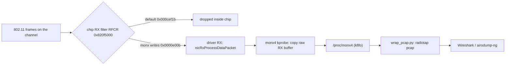

# mt6789-wifi-monitor

> Monitor-mode 802.11 capture on the **internal** Wi-Fi of MediaTek MT6789 (Helio G99) phones — no external USB adapter, 2.4 and 5 GHz.

[](LICENSE)


The stock driver exposes no monitor mode: it never advertises the `monitor`
interface type, its promiscuous entry points are stubs, and the built-in sniffer
code has no call path. The radio still receives every frame on-channel — the chip
just drops what isn't addressed to us, before the driver sees it. This opens the
chip's hardware RX filter and lifts the frames off the driver's RX path with a
kprobe.

|  |  |
|---|---|
| **Device** | Redmi Note 13 Pro 4G / POCO M6 Pro (`emerald`) |
| **SoC / chip** | MediaTek MT6789 (Helio G99), connac2 internal Wi-Fi |
| **Kernel** | stock Google GKI `6.12.30-android16-5` (Android 16) |
| **Needs** | root only — no unlocked bootloader, no external adapter |
| **2.4 GHz data-lock** | ✅ working (verified on-device) |
| **5 GHz discovery** | ✅ working (channel hop) |
| **5 GHz data-lock** | ⬜ open — band-1 RFCR ([docs/BAND1-5GHZ.md](docs/BAND1-5GHZ.md)) |

## How it works



`monx.ko` writes the chip's RX filter register in **normal mode** (association
stays up), clearing the `DROP_*` bits so the chip forwards the whole channel.
`monx4.ko` kprobes the driver RX entry points and copies each raw chip RX buffer
(connac RXD + the 802.11 frame) into a kfifo at `/proc/monx4`. On the host,
`wrap_pcap.py` wraps the frames in radiotap and `dev_inventory.py` inventories
APs and probing clients. Full detail: [docs/MECHANISM.md](docs/MECHANISM.md),
[docs/REGISTERS.md](docs/REGISTERS.md).

## What works

- Full traffic capture on the associated channel (all stations) → radiotap pcap.
- Channel-hop survey of every nearby AP across 2.4 and 5 GHz.
- Output opens in Wireshark / tshark / airodump-ng.

Last on-device check: an 8 s hop captured 162 frames and enumerated 6 APs across
channels 6/11/12/44 (2.4 + 5 GHz), no kernel panic. Modules built from `src/`.

<details>
<summary><b>Quick start</b> — build, push, capture</summary>

```sh
# build (see docs/BUILD.md for the toolchain and the CRC trick)
cd src && KDIR=~/gki-src make          # -> monx.ko, monx4.ko
# or use prebuilt/ if your device runs the same firmware

adb push monx.ko monx4.ko scripts/mon_capture.sh scripts/hop_capture.sh /data/local/tmp/

# capture the current channel's traffic (stay associated to lock the channel):
adb shell su -c 'sh /data/local/tmp/mon_capture.sh 8'
adb pull /data/local/tmp/monx4_cap.bin
python3 scripts/wrap_pcap.py monx4_cap.bin capture.pcap     # -> Wireshark

# or survey every nearby AP (channel hop):
adb shell su -c 'sh /data/local/tmp/hop_capture.sh 20'
adb pull /data/local/tmp/monx4_cap.bin
python3 scripts/dev_inventory.py monx4_cap.bin              # AP + client list
```

Read a chip register live (normal mode): `sh scripts/read_reg.sh 0x820f5000`.
</details>

<details>
<summary><b>Repo layout</b></summary>

```
src/         monx.c (RFCR writer), monx4.c (kprobe capture), Makefile
scripts/     capture (device, sh) + post-processing (host, python) + read_reg.sh
docs/        MECHANISM, REGISTERS, HQA-PROTOCOL, BUILD, BAND1-5GHZ
reference/   device kernel config, symbol CRCs, HQA command table, pentest fragment
prebuilt/    modules + HQA tools built for the emerald kernel (see prebuilt/README)
```
</details>

## Limits (hardware, not fixable in software)

- One radio = one channel at a time; "whole area" = channel hopping.
- 2.4 + 5 GHz only (802.11ac chip). No 6 GHz.
- WPA2 unicast payloads stay encrypted under each station's key — the capture
  sees the frames, not the cleartext, like any sniffer.
- Continuous 5 GHz **data** capture needs the band-1 RFCR, not mapped yet
  ([docs/BAND1-5GHZ.md](docs/BAND1-5GHZ.md) — how to find it); 5 GHz
  **discovery** (beacons via hopping) works.

## Safety

Everything here is volatile and reversible: register writes are RAM (a reboot
restores defaults), `rmmod` removes the modules, and nothing is written to flash,
EEPROM, or efuse. Do not issue HQA/efuse **write** commands
([docs/HQA-PROTOCOL.md](docs/HQA-PROTOCOL.md)) — those can be permanent.

Use it only on networks and devices you are authorized to test. Captures contain
other people's frames and MAC addresses; handle accordingly.

## Provenance

`monx4.c` is the original source. `monx.c` was reconstructed from its documented
module interface (the original was lost) and re-verified on-device. The HQA tools
in `prebuilt/` are binary-only for the same reason; the protocol to rebuild them
is documented. The vendor driver, firmware, ROM images, and partition dumps this
was reversed from are **not** included (proprietary).

## License

GPL-2.0 for the kernel modules (`src/`). See [LICENSE](LICENSE).
